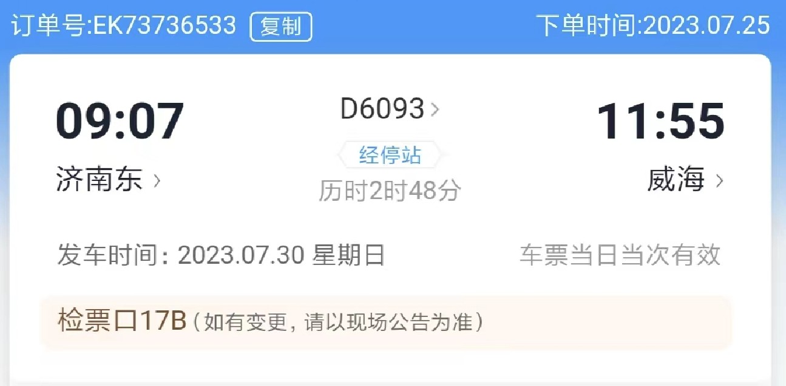
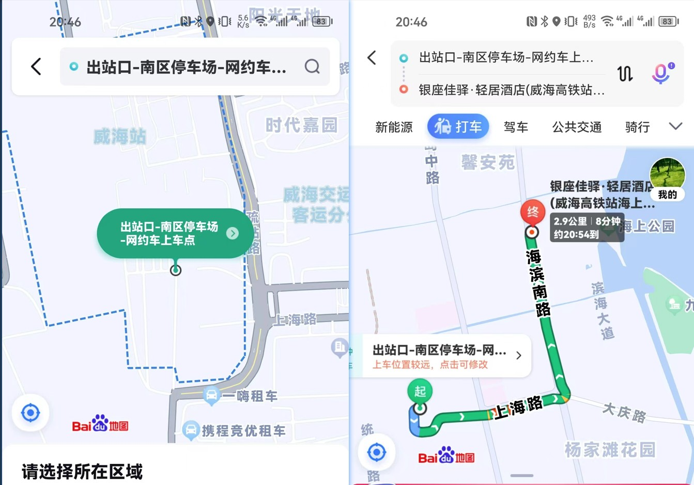
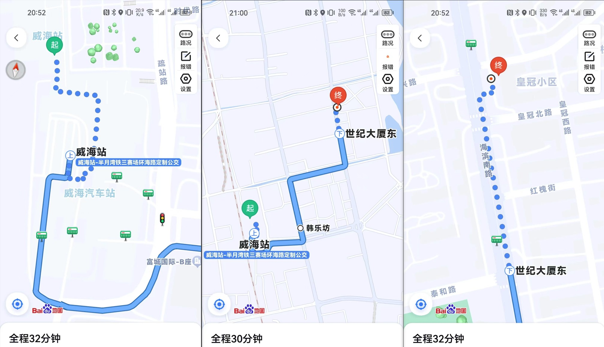
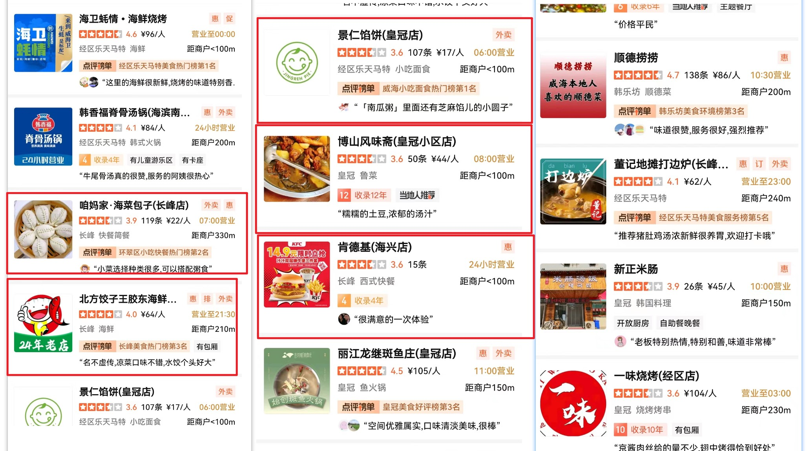
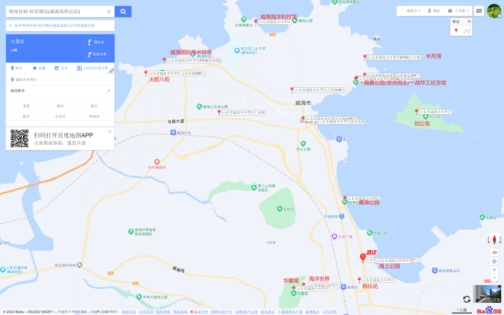
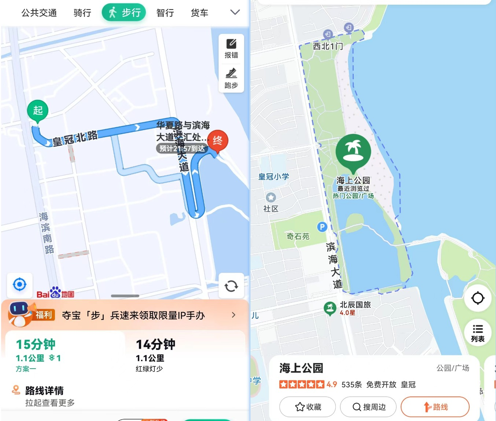
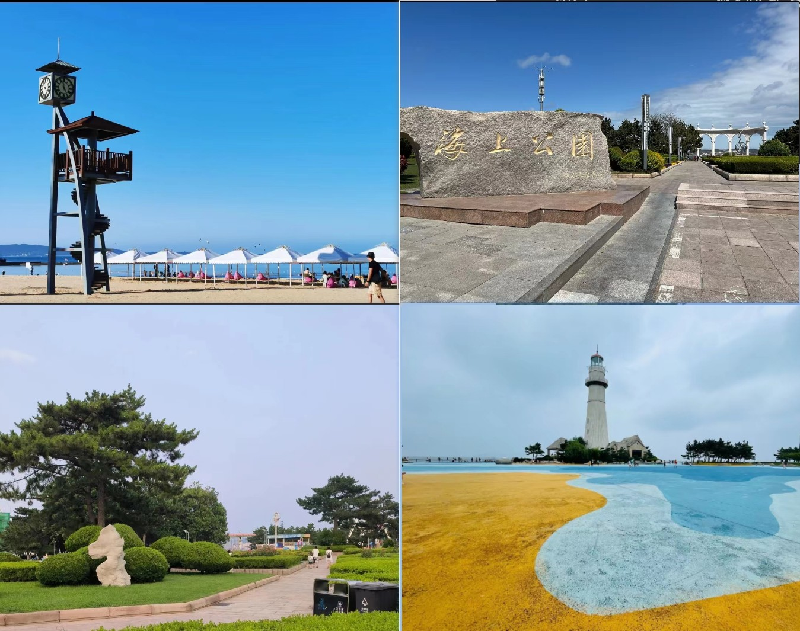
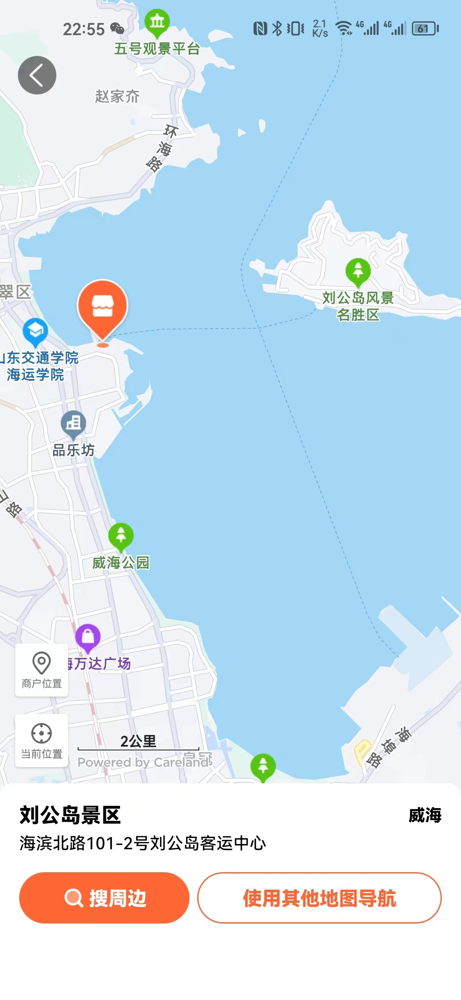

> 文章 ID：E001
>
> 创建时间：2023-07-30
>
> 更新时间：2023-07-30

# 济南-威海

## 1.1 乘动车到威海

| 项目      | 内容                |
| --------- | ------------------- |
| 起点-终点 | 济南东-威海         |
| 车次      | D6093               |
| 座位      | 二等座06车05A\B\C号 |

## 1.2 入住酒店（约12:30到达）

### 1.2.1 威海站 To 酒店（银座佳驿.轻居酒店[威海高铁站海上公园店]）

| 出行方式                                       | 时间     |
| ---------------------------------------------- | -------- |
| 打车                                           | 约8分钟  |
| 公交(半月湾铁三赛场环海路定制公交=>世纪大厦东) | 约30分钟 |

#### 打车

- 需要到**出站口-南区停车场-网约车上车点**上车

#### 公交（半月湾铁三赛场环海路定制公交=>世纪大厦东=>步行）

- 起始站：威海站-半月湾铁三赛场环海路定制公交
- 终点站：世纪大厦东

### 1.2.2 酒店周边吃的

- 酒店周围有吃的

# 推荐路线

### D1(7.30)

1. 济南东--威海站--银座佳驿.轻居酒店[威海高铁站海上公园店]--午休--海上公园/威海公园--晚饭--酒店--休息

### D2(7.31)

1. 酒店--刘公岛--酒店

### D3(8.1)

1. 酒店--威海科技馆/威海神游海洋世界/威海海洋科技馆(远遥蓝贝海洋科技馆)---午饭---韩乐坊--晚饭--酒店
2. 酒店--海源公园--一战华工纪念馆--安庆码头--半月湾--酒店

### D4(8.2)

1. 酒店--火炬八街 --午饭--威海海水浴场（任意可选）--晚饭--酒店
2. 酒店--威海华夏城景区--酒店--晚饭（不建议，游览时间较长）

### D5(8.3)

1. 返程

# 景点

### 海上公园

- 距离1.3公里，步行：15min/打车:3分钟
- 有沙滩，可以看海

## 刘公岛

- 需要坐船到景区
- 游览时间较长，有些景点需要排队
- 提前带点吃的
- 从酒店开车10-20分钟到
- 需要先到刘公岛景区-售票厅买票，坐船至刘公岛

